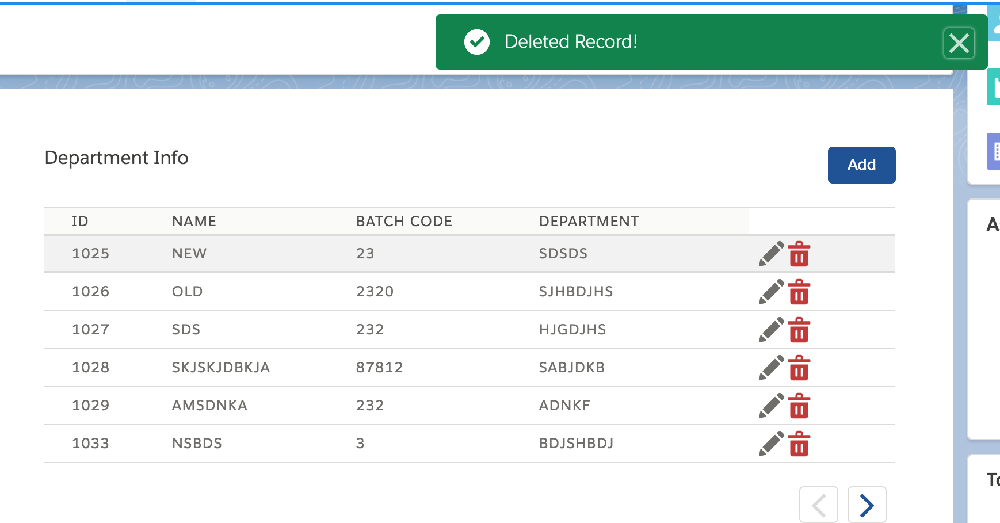

# ListView-Aura-Component

1) Final Table View 

2) Add Details and create Record

3) Edit details and Save

4) Inserted Record with Toastr Message

5) Deleted Record with Toastr Message

6) Loading Status while fetching information from Server controller

